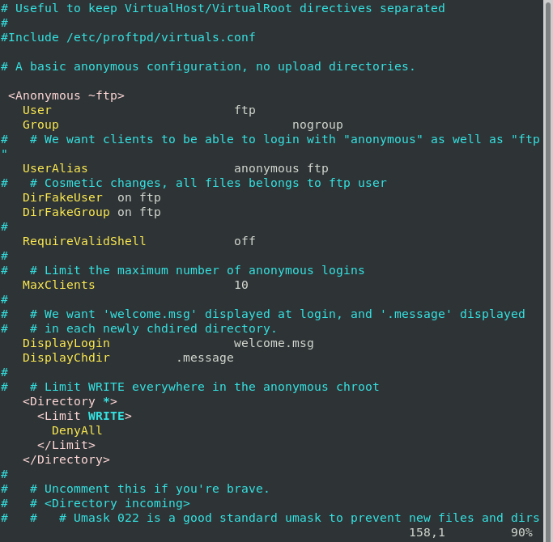

# Usuario anonymous

## Usuarios
A veces es necesario crear cuentas de usuario de acceso al servidor pero que no tengan acceso al sistema y que tampoco estén creados a nivel de sistema operativo. 

- **Usuario de sistema**: Son los usuarios propios del sistema operativo. Cuando se accede al servidor FTP con una cuenta de usuario, normalmente se accede a la carpeta $HOME del usuario.

- **Usuario anónimo**: El usuario anonymous, es un usuario que suele estar presente en muchos servidores FTP donde queremos tener un acceso público para las descargas de ficheros. Este usuario únicamente suele tener permiso de lectura y su password suele ser cualquier cadena de texto.

- **Usuario virtual**: Son usuarios independientes de los usuarios del sistema. Realmente no existen como usuarios normales del sistema operativo.
Un usuario virtual, no tiene cuenta REAL en el sistema.

### ⚠️⚠️⚠️ OJO AL COPIAR PROBLEMAS DE TABULACIONES⚠️⚠️⚠️

### Modificar el proftpd.conf

```bash
vi /etc/proftpd/proftpd.conf
```

*Linea 149*

**Quitando comentarios y lineas en blanco**

```conf
 <Anonymous ~ftp>
   User				ftp
   Group				nogroup
   UserAlias			anonymous ftp
   DirFakeUser	on ftp
   DirFakeGroup on ftp
   RequireValidShell		off
   MaxClients			10
   DisplayLogin			welcome.msg
   DisplayChdir		.message
   <Directory *>
     <Limit WRITE>
       DenyAll
     </Limit>
   </Directory>
 </Anonymous>
```

***⚠️Ojo cerrar la directiva anonymous < / Anonymous >⚠️***



**Sintaxis y Reiniciar servicio**

```bash
#Sintaxis
proftpd -t
systemctl restart proftpd.service
systemctl status proftpd.service
```

**Comprobar acceso**

|Directiva  |Función  |
|:---------:|---------|
|RequireValidShell off|No es necesario que anonymous tenga una cuenta creada en el sistema.|
|DirFakeUser|Para ocultar el propietario del directorio/archivo real.|
|DisplayLogin        welcome.msg|Mensaje de bienvenida.|
|DisplayFirstChdir   .message| Mensaje al cambiar de directorio.|

## EJEMPLOS DE OTRAS CONFIGURACIONES


```conf
<Directory /home/ftp/*>
    <Limit READ>
        AllowAll #Permitimos leer a todo el mundo en el directorio /home/ftp
   </Limit>
   <Limit Write>
        DenyAll        #Impedimos la escritura en el mismo
   </Limit>
</Directory>
```

```conf
<Directory /home/ftp/incoming/*>
    <Limit STOR CMD MKD WRITE>
  	  AllowALL   #Permitimos subir, crear directorios, etc
   </Limit>
   <Limit RETR DELE>            #Impedimos bajar o borrar
      DenyALL
   </Limit>
</Directory>
```

```conf
   <Directory /srv/ftp/subida/*>
   <Limit Write>
        AllowAll
   </Limit>
   </Directory>
```

```conf
<Limit LOGIN>
    DenyUser paco,pepa #Impide el acceso a paco y pepa
</Limit>
```

**Resumen de permisos:**


## Crear un directorio llamado subida que permita escribir.

```bash
mkdir /srv/ftp/subida
cd /srv/ftp/subida
wget https://s1.eestatic.com/2019/08/09/omicrono/omicrono_420219253_131917138_1024x576.jpg
wget https://s1.eestatic.com/2019/08/09/omicrono/omicrono_420219253_131917138_1024x576.jpg
chown -R ftp:nogroup /srv/ftp/subida
ls -lRa /srv/ftp/
```

**Quitando comentarios y lineas en blanco**

```conf
 <Anonymous ~ftp>
   User                         ftp
   Group                                nogroup
   UserAlias                    anonymous ftp
   DirFakeUser  on ftp
   DirFakeGroup on ftp
   RequireValidShell            off
   MaxClients                   10
   DisplayLogin                 welcome.msg
   DisplayChdir         .message
   <Directory *>
     <Limit WRITE>
      DenyAll
     </Limit>
   </Directory>
   <Directory /srv/ftp/subida/*>
   <Limit Write>
        AllowAll
   </Limit>
   </Directory>
 </Anonymous>
```

**Sintaxis y Reiniciar servicio**

```bash
#Sintaxis
proftpd -t
systemctl restart proftpd.service
systemctl status proftpd.service
```

*PROBAR SUBIDAS...*

_________________________________________________
*[Volver atrás...](../../README.md)*