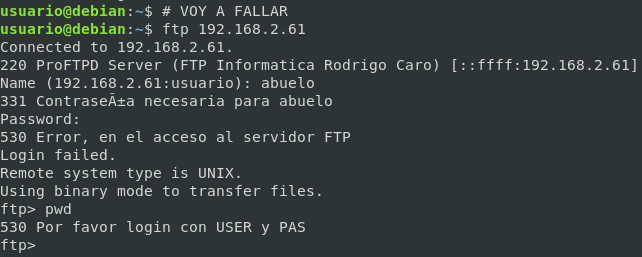
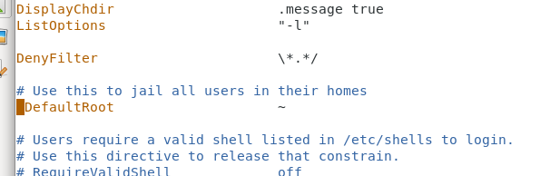
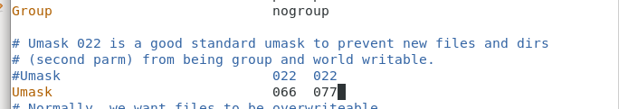

# Usuario anonymous

## Usuarios
A veces es necesario crear cuentas de usuario de acceso al servidor pero que no tengan acceso al sistema y que tampoco estén creados a nivel de sistema operativo. 

- **Usuario de sistema**: Son los usuarios propios del sistema operativo. Cuando se accede al servidor FTP con una cuenta de usuario, normalmente se accede a la carpeta $HOME del usuario.

- **Usuario anónimo**: El usuario anonymous, es un usuario que suele estar presente en muchos servidores FTP donde queremos tener un acceso público para las descargas de ficheros. Este usuario únicamente suele tener permiso de lectura y su password suele ser cualquier cadena de texto.

- **Usuario virtual**: Son usuarios independientes de los usuarios del sistema. Realmente no existen como usuarios normales del sistema operativo.
Un usuario virtual, no tiene cuenta REAL en el sistema.

### Modificar el ServerName

```bash
vi /etc/proftpd/proftpd.conf
```

*Liena 149*

**Quitando comentarios y lineas en blanco**

```conf
 <Anonymous ~ftp>
   User				ftp
   Group				nogroup
   UserAlias			anonymous ftp
   DirFakeUser	on ftp
   DirFakeGroup on ftp
   RequireValidShell		off
   MaxClients			10
   DisplayLogin			welcome.msg
   DisplayChdir		.message
   <Directory *>
     <Limit WRITE>
       DenyAll
     </Limit>
   </Directory>
 </Anonymous>
```

***⚠️Ojo cerrar la directiva anonymous </Anonymous>⚠️***


**Sintaxis y Reiniciar servicio**

```bash
#Sintaxis
proftpd -t
systemctl restart proftpd.service
systemctl status proftpd.service
```

<!-- ### Directiva de mensaje Bienvenida y error de conexión

```conf
AccessGrantMSG "Bienvenido al servidor FTP de Informatica RC"
AccessDenyMSG "Error, en el acceso al servidor FTP"
```


** Sintaxis y Reiniciar servicio**

```bash
#Sintaxis
proftpd -t
systemctl restart proftpd.service
systemctl status proftpd.service
```

#### Comprobaciones de acceso




## Enjaular usuarios

```conf
DefaultRoot			~
```


```bash
#Sintaxis
proftpd -t
systemctl restart proftpd.service
systemctl status proftpd.service
```

## Cambiar permisos por defecto (Umask)

```conf
Umask				066  077
```

```bash
#Sintaxis
proftpd -t
systemctl restart proftpd.service
systemctl status proftpd.service
```



## Cambiar permisos por defecto (Umask)

```conf
Umask				066  077
```


** Sintaxis y Reiniciar servicio**

```bash
#Sintaxis
proftpd -t
systemctl restart proftpd.service
systemctl status proftpd.service
```

 -->

_________________________________________________
*[Volver atrás...](../../README.md)*