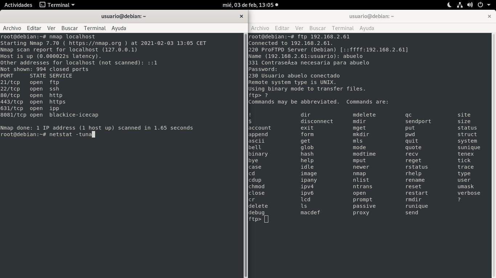
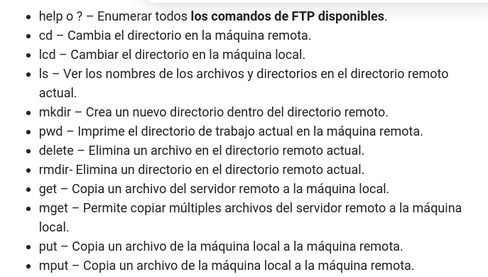
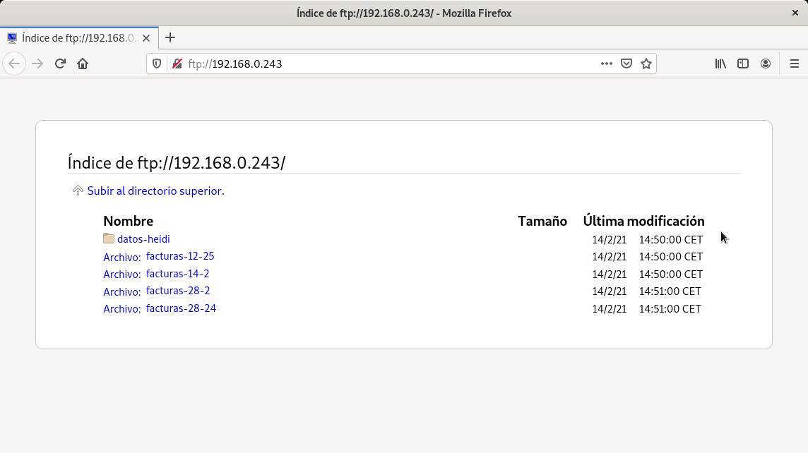
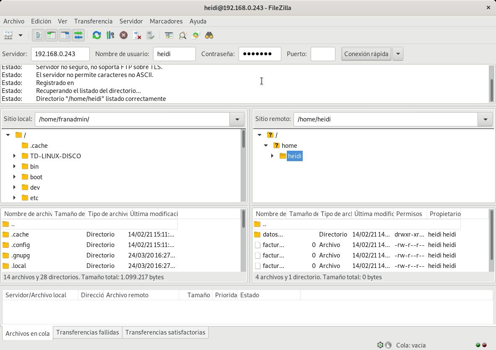

# Conexiones con el servidor FTP (Desde cliente)

## Desde la Shell

```bash
apt-get install ftp -y
ftp 192.168.2.61
```
*Usar un usuario del sistema*



*Para ver los posibles comandos escribir un: ``?``*

**Breve resumen de comandos:**



## Desde el navegador

```bash
firefox ftp://192.168.0.243
```




## Cliente FTP Gráfico

```bash
apt-get install filezilla
# abrir filezilla
filezilla &
```



_________________________________________________
*[Volver atrás...](../../README.md)*