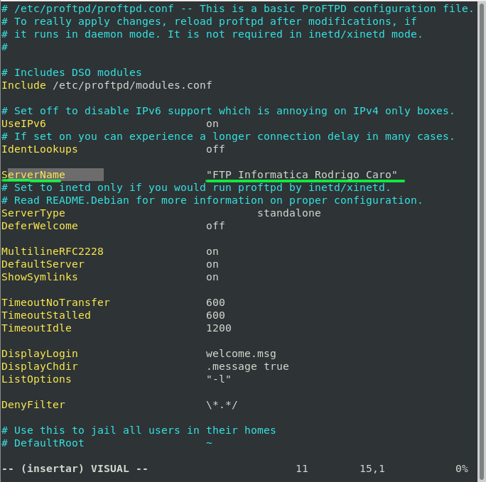
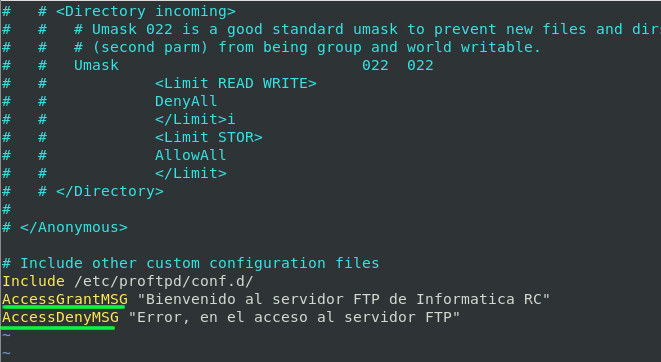
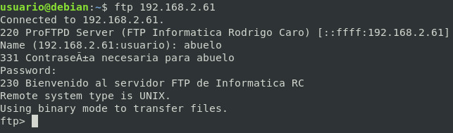
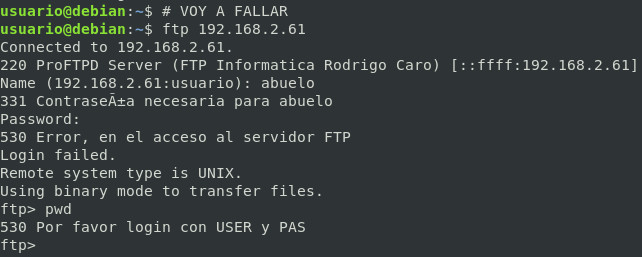
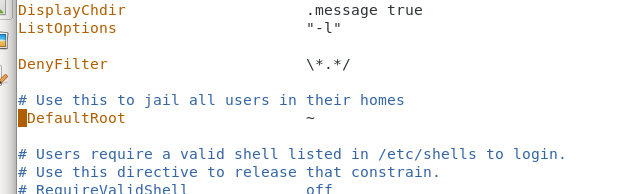
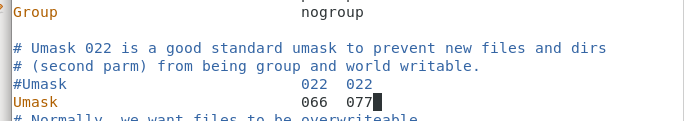
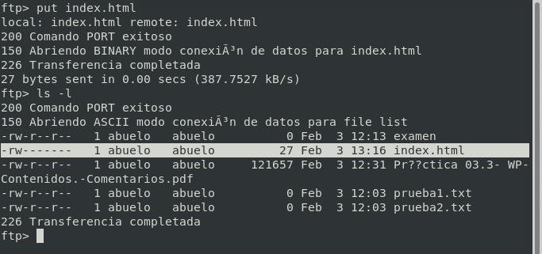

# Configuración por defecto

## Fichero por defecto:/etc/proftpd/proftpd.conf


|Directiva  |Función  |
|:---------:|---------|
|ServerName|Nombre del servidor que aparecerá en programa cliente.|
|DeferWelcome|Para activar o desactivar el mensaje de bienvenida al servidor.|
|ShowSymlinks|Para que nos muestre los links para saltar entre las carpetas.|
|TimeoutIdle|El número de segundos que puede estar el cliente sin actividad (Sin hacer nada). Si llega a ese tiempo lo expulsa.|
|Port|Puerto. Lo podríamos modificar.|
|MaxInstances|El número de conexiones simultáneas al servidor.|
|User|Usuario por defecto. del servidor|
|Group|Grupo por defecto.|
|Umask|Para establecer los permisos por defecto de los archivos que se creen en el servidor ftp.|
|xferlog|Dónde se guarda los logs de las transferencias. --> tail -n 15 /var/log/proftpd/xferlog|
|SystemLog|Dónde se guardan las respuestas del servidor. --> cat /var/log/proftpd/proftpd.log|

## Modificaciones
### Modificar el ServerName

```bash
apt-get install proftpd-doc -y
```

### Directiva de bienvenida al servidor

```conf
ServerName			"FTP Informatica Rodrigo Caro"
```



### Directiva de mensaje conexion y error de conexión

```conf
AccessGrantMSG "Bienvenido al servidor FTP de Informatica RC"
AccessDenyMSG "Error, en el acceso al servidor FTP"
```



** Sintaxis y Reiniciar servicio**

```bash
#Sintaxis
proftpd -t
systemctl restart proftpd.service
systemctl status proftpd.service
```

#### Comprobaciones de acceso




## Enjaular usuarios

```conf
DefaultRoot			~
```


```bash
#Sintaxis
proftpd -t
systemctl restart proftpd.service
systemctl status proftpd.service
```

## Cambiar permisos por defecto (Umask)

```conf
Umask				066  077
```

```bash
#Sintaxis
proftpd -t
systemctl restart proftpd.service
systemctl status proftpd.service
```



## Cambiar permisos por defecto (Umask)

```conf
Umask				066  077
```


** Sintaxis y Reiniciar servicio**

```bash
#Sintaxis
proftpd -t
systemctl restart proftpd.service
systemctl status proftpd.service
```


_________________________________________________
*[Volver atrás...](../../README.md)*