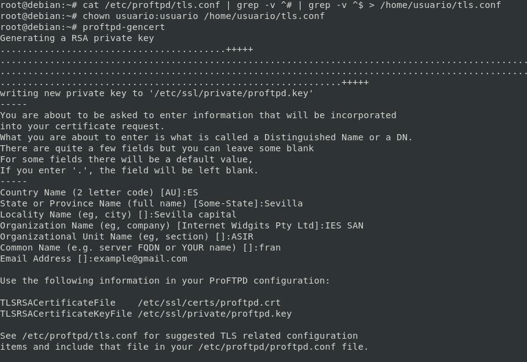

# Conexión segura FTPs

## Activar configuración a tls.conf

```bash
echo "Include /etc/proftpd/tls.conf" >> /etc/proftpd/proftpd.conf
```
## Añadir a tls.conf

```conf
<IfModule mod_tls.c>
TLSEngine                               on
TLSLog                                  /var/log/proftpd/tls.log
TLSProtocol                             SSLv23
TLSRSACertificateFile                   /etc/ssl/certs/proftpd.crt
TLSRSACertificateKeyFile                /etc/ssl/private/proftpd.key
TLSOptions                      NoCertRequest EnableDiags 
TLSOptions                      NoCertRequest EnableDiags NoSessionReuseRequired
TLSOptions 							AllowClientRenegotiations
TLSVerifyClient                         off
TLSRequired                             on
TLSRenegotiate                          required off
</IfModule>
```

**ó**

```bash
echo '<IfModule mod_tls.c>' >> /etc/proftpd/tls.conf
echo 'TLSEngine                               on' >> /etc/proftpd/tls.conf
echo 'TLSLog                                  /var/log/proftpd/tls.log' >> /etc/proftpd/tls.conf
echo 'TLSProtocol                             SSLv23' >> /etc/proftpd/tls.conf
echo 'TLSRSACertificateFile                   /etc/ssl/certs/proftpd.crt' >> /etc/proftpd/tls.conf
echo 'TLSRSACertificateKeyFile                /etc/ssl/private/proftpd.key' >> /etc/proftpd/tls.conf
echo 'TLSOptions                      NoCertRequest EnableDiags ' >> /etc/proftpd/tls.conf
echo 'TLSOptions                      NoCertRequest EnableDiags NoSessionReuseRequired' >> /etc/proftpd/tls.conf
echo 'TLSOptions 							AllowClientRenegotiations' >> /etc/proftpd/tls.conf
echo 'TLSVerifyClient                         off' >> /etc/proftpd/tls.conf
echo 'TLSRequired                             on' >> /etc/proftpd/tls.conf
echo 'TLSRenegotiate                          required off' >> /etc/proftpd/tls.conf
echo '</IfModule>' >> /etc/proftpd/tls.conf
```

```bash
proftpd-gencert
```


**Sintaxis y Reiniciar servicio**

```bash
#Sintaxis
proftpd -t
systemctl restart proftpd.service
systemctl status proftpd.service
```

## Configurar cifrado en todos los sitios virtuales (TLS)

## Añadir en virtuals.conf

```conf
<Global>
<IfModule mod_tls.c>
TLSEngine                               on
TLSLog                                  /var/log/proftpd/tls.log
TLSProtocol                             SSLv23
TLSRSACertificateFile                   /etc/ssl/certs/proftpd.crt
TLSRSACertificateKeyFile                /etc/ssl/private/proftpd.key
TLSOptions                      NoCertRequest EnableDiags 
TLSOptions                      NoCertRequest EnableDiags NoSessionReuseRequired
TLSOptions 							AllowClientRenegotiations
TLSVerifyClient                         off
TLSRequired                             on
TLSRenegotiate                          required off
</IfModule>
</Global>
```

**ó**

```conf
echo '<Global>' >> /etc/proftpd/virtuals.conf
echo '<IfModule mod_tls.c>' >> /etc/proftpd/virtuals.conf
echo 'TLSEngine                               on' >> /etc/proftpd/virtuals.conf
echo 'TLSLog                                  /var/log/proftpd/tls.log' >> /etc/proftpd/virtuals.conf
echo 'TLSProtocol                             SSLv23' >> /etc/proftpd/virtuals.conf
echo 'TLSRSACertificateFile                   /etc/ssl/certs/proftpd.crt' >> /etc/proftpd/virtuals.conf
echo 'TLSRSACertificateKeyFile                /etc/ssl/private/proftpd.key' >> /etc/proftpd/virtuals.conf
echo 'TLSOptions                      NoCertRequest EnableDiags ' >> /etc/proftpd/virtuals.conf
echo 'TLSOptions                      NoCertRequest EnableDiags NoSessionReuseRequired' >> /etc/proftpd/virtuals.conf
echo 'TLSOptions 							AllowClientRenegotiations' >> /etc/proftpd/virtuals.conf
echo 'TLSVerifyClient                         off' >> /etc/proftpd/virtuals.conf
echo 'TLSRequired                             on' >> /etc/proftpd/virtuals.conf
echo 'TLSRenegotiate                          required off' >> /etc/proftpd/virtuals.conf
echo '</IfModule>' >> /etc/proftpd/virtuals.conf
echo '</Global>' >> /etc/proftpd/virtuals.conf
```

_________________________________________________
*[Volver atrás...](../../README.md)*