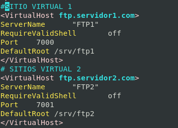

# Crear Sitios Virtuales

El término Virtual Host se refiere a hacer funcionar más de un sitio (ftp,web etc ...) como por ejemplo www.servidor1.com y www.servidor2.com en una misma máquina. Los Hosts Virtuales pueden funcionar basándose en "direcciones IP", lo que significa que cada Virtual Host tiene una dirección IP diferente, o basados en "nombres de dominio", lo que significa que con una sola dirección IP están funcionando Virtual Hosts con diferentes nombres de dominio. Este proceso es totalmente transparente para el usuario final.

Con VirtualHosts podemos tener varios servidores FTP en un mismo servidor.

>[Importante]FTP NO ES CAPAZ DE DETECTAR EL NOMBRE DE DOMINIO.
SOLO REDIRECCIONA IP Y PUERTO.

## Pre-coniguración

```bash
echo "Include /etc/proftpd/virtuals.conf" >> /etc/proftpd/proftpd.conf
cp virtuals.conf virtuals.conf.ORIGINAL
```

**Sintaxis y Reiniciar servicio**

```bash
#Sintaxis
proftpd -t
systemctl restart proftpd.service
systemctl status proftpd.service
```

## Crear sitio virtual 1

```bash
mkdir /srv/FTP1
cd /srv/FTP1/
wget https://s1.eestatic.com/2019/08/09/omicrono/omicrono_420219253_131917138_1024x5
touch FTP1-prueba
chown -R ftp:nogroup /srv/
```

*Añadir a `/etc/proftpd/virtuals.conf`*

```conf
<VirtualHost ftp1.server211.com>
ServerName              "FTP1"
Port    7000
RequireValidShell       off
DefaultRoot             /srv/FTP1    
</VirtualHost>
```

**ó**

```bash
echo '<VirtualHost ftp1.server211.com>' >> /etc/proftpd/virtuals.conf
echo 'ServerName              "FTP1"' >> /etc/proftpd/virtuals.conf
echo 'Port    7000' >> /etc/proftpd/virtuals.conf
echo 'RequireValidShell       off' >> /etc/proftpd/virtuals.conf
echo 'DefaultRoot             /srv/FTP1' >> /etc/proftpd/virtuals.conf
echo '</VirtualHost>' >> /etc/proftpd/virtuals.conf
```

**Sintaxis y Reiniciar servicio**

```bash
#Sintaxis
proftpd -t
systemctl restart proftpd.service
systemctl status proftpd.service
```

## VirtualHosts 2

```bash
mkdir /srv/FTP2
cd /srv/FTP2/
wget https://s1.eestatic.com/2019/08/09/omicrono/omicrono_420219253_131917138_1024x5
touch FTP2-prueba
chown -R ftp:nogroup /srv/
```

*Añadir a `/etc/proftpd/virtuals.conf`*

```conf
<VirtualHost ftp2.server211.com>
ServerName              "FTP2"
Port    7001
RequireValidShell       off
DefaultRoot             /srv/FTP2    
</VirtualHost>
```

**ó**

```bash
echo '<VirtualHost ftp2.server211.com>' >> /etc/proftpd/virtuals.conf
echo 'ServerName              "FTP2"' >> /etc/proftpd/virtuals.conf
echo 'Port    7001' >> /etc/proftpd/virtuals.conf
echo 'RequireValidShell       off' >> /etc/proftpd/virtuals.conf
echo 'DefaultRoot             /srv/FTP2' >> /etc/proftpd/virtuals.conf
echo '</VirtualHost>' >> /etc/proftpd/virtuals.conf
```



<!-- ### Directiva de mensaje Bienvenida y error de conexión

```conf
AccessGrantMSG "Bienvenido al servidor FTP de Informatica RC"
AccessDenyMSG "Error, en el acceso al servidor FTP"
```


** Sintaxis y Reiniciar servicio**

```bash
#Sintaxis
proftpd -t
systemctl restart proftpd.service
systemctl status proftpd.service
```

#### Comprobaciones de acceso


## Enjaular usuarios

```conf
DefaultRoot			~
```


```bash
#Sintaxis
proftpd -t
systemctl restart proftpd.service
systemctl status proftpd.service
```

## Cambiar permisos por defecto (Umask)

```conf
Umask				066  077
```

```bash
#Sintaxis
proftpd -t
systemctl restart proftpd.service
systemctl status proftpd.service
```


## Cambiar permisos por defecto (Umask)

```conf
Umask				066  077
```


** Sintaxis y Reiniciar servicio**

```bash
#Sintaxis
proftpd -t
systemctl restart proftpd.service
systemctl status proftpd.service
```

 -->

_________________________________________________
*[Volver atrás...](../../README.md)*
