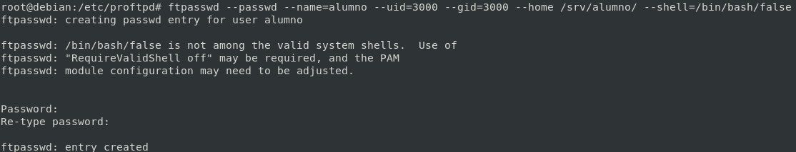
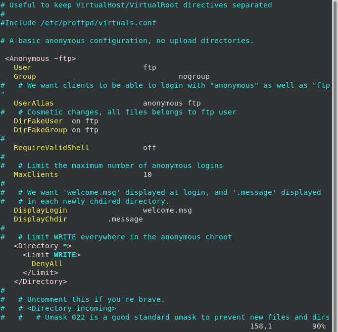

# Usuario Virtuales

## Usuarios

Usuario virtual: Son usuarios independientes de los usuarios del sistema. Realmente no existen como usuarios normales del sistema operativo.
Un usuario virtual, no tiene cuenta REAL en el sistema.

### ⚠️⚠️⚠️ OJO AL COPIAR PROBLEMAS DE TABULACIONES⚠️⚠️⚠️

### Crear Usuarios Virtuales

```bash
echo "DefaultRoot ~" >> /etc/proftpd/proftpd.conf
echo "RequireValidShell off" >> /etc/proftpd/proftpd.conf
echo "AuthUserFile /etc/proftpd/ftpd.passwd" >> /etc/proftpd/proftpd.conf
mkdir /srv/alumno
mkdir /srv/profesor
cd /srv/alumno/
wget https://s1.eestatic.com/2019/08/09/omicrono/omicrono_420219253_131917138_1024x576.jpg
touch pruba-alumno.txt
cd /srv/profesor/
wget https://s1.eestatic.com/2019/08/09/omicrono/omicrono_420219253_131917138_1024x576.jpg
touch prueba-profesor.txt
chown -R ftp:nogroup /srv/
chmod 777 -R /srv/profesor/
ls -Rl /srv/ 
ftpasswd --passwd --name=alumno --uid=3000 --gid=3000 --home /srv/alumno/ --shell=/bin/bash/false
ftpasswd --passwd --name=profesor --uid=4000 --gid=4000 --home /srv/profesor/ --shell=/bin/bash/false
```

*crear usuarios...*




**Sintaxis y Reiniciar servicio**

```bash
#Sintaxis
proftpd -t
systemctl restart proftpd.service
systemctl status proftpd.service
```

### Manejo de Usuarios
```bash
ftpasswd --passwd --name=alumno --lock
ftpasswd --passwd --name=alumno --unlock
ftpasswd --passwd --name=alumno --change-password
```



*PROBAR SUBIDAS...*

_________________________________________________
*[Volver atrás...](../../README.md)*
